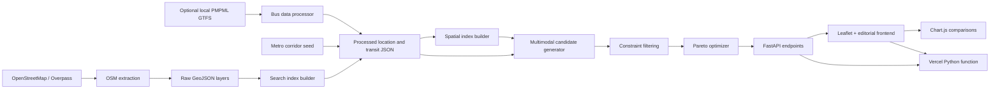

# PuneCentric

### Pune Multimodal Route Explorer

Explore practical ways to travel across Pune. PuneCentric compares route choices by time, fare, walking effort, and estimated carbon emissions.


PuneCentric is a route exploration prototype for Pune and Pimpri-Chinchwad. It combines curated or OpenStreetMap-derived place data with seeded PMPML and Pune Metro corridors. Transit times, fares, and emissions are estimates from configurable models; they are not live vehicle tracking or official journey guarantees.

## Project architecture



### Repository layout

```text
app/
  api/            Search, health, and route endpoints
  calculations/   Distance, fare, and emissions models
  models/         Pydantic request and response schemas
  routing/        Candidate generation, constraints, Pareto, and caching
  transport/      Walking, bus, metro, and auto routers
data/
  boundaries/ localities/ pois/ transit/ processed/
frontend/         Leaflet map, search UI, route cards, and charts
scripts/          Extraction, transit processing, and data/index builders
tests/            Pytest unit and API tests
public/data/      Deployment-ready processed JSON (generated)
```

## Features

- **Pareto multi-objective routing:** filters and ranks choices across duration, fare, estimated CO₂, and walking distance. Optional hard limits constrain budget, walking distance, and transfers.
- **Four travel modes:** pedestrian walking, PMPML bus corridors, Pune Metro Lines 1 and 2 with a Civil Court interchange, and auto-rickshaw.
- **Fare estimates:** centralized mode-specific fare models, including the configured September 2026 Pune auto-rickshaw tariff and optional night surcharge.
- **Environmental comparisons:** estimated CO₂, savings against a private-car baseline, and equivalents expressed as tree-days and smartphone charges.
- **Interactive map and search:** Leaflet map centered on Pune, place autocomplete, route polylines, and route selection by map click.
- **Visual comparison:** Chart.js time, fare, and emissions charts, alongside an editorial responsive interface.
- **Offline-tolerant data preparation:** OSM extraction scripts use seed GeoJSON data when Overpass is unavailable; bus and metro processors can generate local corridor datasets.

## Requirements

- Python 3.12 or newer
- Internet access for OpenStreetMap map tiles and optional Overpass extraction
- Windows PowerShell, macOS, or Linux shell

## Local development

Clone the repository, create a virtual environment, install dependencies, then start the API and frontend:

```bash
git clone <repo-url>
cd PuneCentric2.0
python -m venv venv
source venv/bin/activate  # macOS/Linux
# Windows PowerShell: .\venv\Scripts\Activate.ps1
python -m pip install --upgrade pip
pip install -r requirements.txt
python scripts/build_static_data.py
python scripts/build_spatial_index.py
uvicorn app.main:app --reload
```

Open <http://127.0.0.1:8000>. Keep the terminal running while using the app. Stop the development server with **Ctrl+C**.

In PowerShell, the equivalent startup sequence is:

```powershell
Set-Location "C:\path\to\PuneCentric2.0"
.\venv\Scripts\Activate.ps1
python -m pip install -r requirements.txt
python scripts/build_static_data.py
python scripts/build_spatial_index.py
python -m uvicorn app.main:app --reload --host 127.0.0.1 --port 8000
```

### Rebuild the datasets

Run the processing scripts when source data changes. OSM extraction contacts Overpass and may use its bundled seed dataset if the service is unavailable. `process_gtfs.py` uses a local PMPML GTFS feed when configured/found, otherwise its corridor seed is written.

```bash
python scripts/extract_pune_osm.py
python scripts/build_search_index.py
python scripts/process_gtfs.py
python scripts/process_metro.py
python scripts/build_spatial_index.py
python scripts/build_static_data.py
```

The final two commands generate the portable spatial indexes in `data/processed/` and the compact deployment copies plus manifest in `public/data/`. The API can rebuild its point index in memory when a spatial-index JSON file is missing or invalid.

## API overview

Interactive API documentation is available at <http://127.0.0.1:8000/docs>.

| Method | Endpoint | Purpose |
| --- | --- | --- |
| `GET` | `/api/health` | Service status |
| `GET` | `/api/search?q=Shaniwar&limit=10` | Search places by name, locality, or category |
| `GET` | `/api/locations` | Major regions used to initialize the map |
| `GET` | `/api/search/nearby?lat=18.52&lng=73.85` | Nearby indexed locations |
| `GET` | `/api/search/reverse?lat=18.52&lng=73.85` | Resolve a coordinate to a nearby place |
| `POST` | `/api/routes/walking` | Direct walking estimate |
| `POST` | `/api/routes/bus` | Bus journey with walking access legs |
| `POST` | `/api/routes/metro` | Metro journey with station access and transfers |
| `POST` | `/api/routes/auto` | Direct auto-rickshaw estimate |
| `POST` | `/api/routes/multimodal` | Filtered, Pareto-ranked route options |

Example multimodal request:

```json
{
  "origin": { "lat": 18.5204, "lng": 73.8567, "label": "Pune" },
  "destination": { "lat": 18.5314, "lng": 73.8446, "label": "Shivajinagar" },
  "constraints": {
    "max_budget_inr": 100,
    "max_walk_distance_km": 2,
    "max_transfers": 2
  }
}
```

## Deployment readiness

Vercel is configured to run `app/main.py` as a Python function for `/api/*`. The Vercel build hook in `pyproject.toml` runs `scripts/build_static_data.py`; the generated JSON is mounted at `/data/` and configured for one-day immutable caching. Frontend files are served through FastAPI static mounts and can be promoted to Vercel's CDN.

Before deploying:

1. Ensure all three processed files exist: `pune_locations.json`, `pune_bus_network.json`, and `pune_metro_network.json` under `data/processed/`.
2. Run the data and spatial index build steps above; confirm `public/data/static_data_manifest.json` is generated.
3. Deploy the repository with its `vercel.json` and `pyproject.toml` configuration.
4. Set `PUNECENTRIC_CORS_ORIGINS` to a comma-separated list of any external frontend origins that need API access. Vercel preview domains are allowed by the app configuration.
5. Check `/api/health`, `/api/locations`, and `/` on the deployed domain.

The OpenStreetMap standard tile service requires visible attribution and is intended for reasonable interactive use under its [tile usage policy](https://operations.osmfoundation.org/policies/tiles/). For sustained or high-volume production traffic, select a tile provider or host tiles with a service level appropriate to the deployment.

## Testing

Run the automated suite from the repository root:

```bash
python -m pytest
```

## Data and estimate notes

- OSM extraction is subject to Overpass availability and the OSM data license. Seed locations and corridor coordinates are approximate where source data is unavailable.
- The seeded metro and bus networks support route exploration; this project does not provide live arrivals, service calendars, disruption notices, or complete timetable planning.
- Fare schedules and emissions factors are application estimates. Review them against current operator and regulatory sources before using them for operational, commercial, or public-service decisions.
- Route geometry may be approximated when a pedestrian graph is not loaded.

## License

MIT License
Copyright (c) 2026 Jahnavi_Sarang_Deshkar
